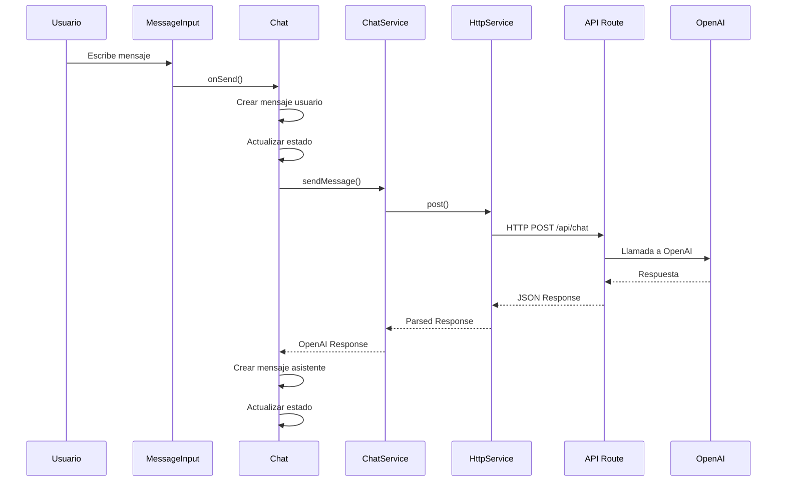
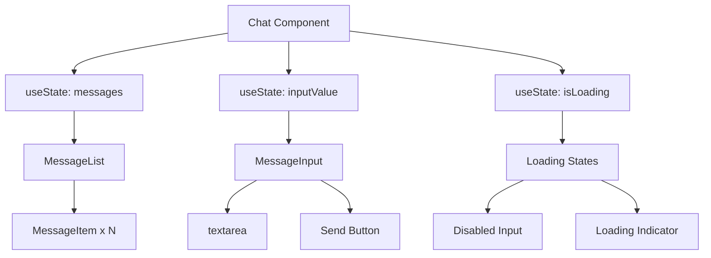

# 🏗️ Arquitectura del Sistema

## 📋 Resumen Ejecutivo

TitanicChat es una aplicación web de chat conversacional construida con **Next.js 15** y **React 19**, que utiliza la **API de OpenAI** para generar respuestas inteligentes. La arquitectura sigue principios de **separación de responsabilidades**, **componentes atómicos** y **arquitectura limpia**.

## 🎯 Principios de Diseño

### 1. **Separación de Responsabilidades**
- **Presentación**: Componentes React puros
- **Lógica de negocio**: Servicios y helpers
- **Tipos**: Interfaces y types separados
- **Estado**: Gestión centralizada

### 2. **Componentes Atómicos**
- Componentes pequeños (< 100 líneas)
- Reutilizables y testeable
- Una responsabilidad por componente
- Props tipadas estrictamente

### 3. **Arquitectura Limpia**
- Dependencias hacia adentro
- Abstracciones estables
- Inversión de dependencias
- Testabilidad máxima

## 🏛️ Arquitectura General

```
┌─────────────────────────────────────────────────────────┐
│                    PRESENTACIÓN                         │
│  ┌─────────────┐  ┌─────────────┐  ┌─────────────┐     │
│  │   Chat.tsx  │  │MessageList │  │MessageInput │     │
│  │  (Container)│  │   (View)    │  │  (Input)    │     │
│  └─────────────┘  └─────────────┘  └─────────────┘     │
└─────────────────────────────────────────────────────────┘
                            │
                            ▼
┌─────────────────────────────────────────────────────────┐
│                   LÓGICA DE NEGOCIO                     │
│  ┌─────────────┐  ┌─────────────┐  ┌─────────────┐     │
│  │ChatService  │  │HttpService  │  │   Helpers   │     │
│  │(API calls)  │  │(HTTP layer) │  │(Utilities)  │     │
│  └─────────────┘  └─────────────┘  └─────────────┘     │
└─────────────────────────────────────────────────────────┘
                            │
                            ▼
┌─────────────────────────────────────────────────────────┐
│                     INFRAESTRUCTURA                     │
│  ┌─────────────┐  ┌─────────────┐  ┌─────────────┐     │
│  │  API Route  │  │  OpenAI API │  │  Next.js    │     │
│  │(/api/chat)  │  │(External)   │  │(Framework)  │     │
│  └─────────────┘  └─────────────┘  └─────────────┘     │
└─────────────────────────────────────────────────────────┘
```

## 📁 Estructura de Directorios

```
src/
├── app/                    # Next.js App Router
│   ├── api/chat/          # API Routes
│   │   └── route.ts       # Chat endpoint
│   ├── layout.tsx         # Layout principal
│   └── page.tsx           # Página home
├── components/            # Componentes React
│   └── chat/              # Componentes del chat
│       ├── Chat.tsx       # Componente contenedor
│       ├── MessageList.tsx # Lista de mensajes
│       ├── MessageInput.tsx # Input de mensajes
│       └── MessageItem.tsx # Item individual
├── services/              # Servicios de negocio
│   ├── http.service.ts    # Cliente HTTP base
│   ├── chat.service.ts    # Servicio de chat
│   └── chat.helpers.ts    # Utilidades del chat
├── types/                 # Definiciones de tipos
│   └── chat.types.ts      # Tipos del chat
└── interfaces/            # Interfaces de API
    └── api.interfaces.ts  # Contratos de API
```

## 🔄 Flujo de Datos

### 1. **Flujo de Envío de Mensaje**



### 2. **Flujo de Renderizado**



## 🧩 Componentes Principales

### 1. **Chat.tsx** (Contenedor)
- **Responsabilidad**: Orquestación y estado global
- **Estado**: Mensajes, input, loading, errores
- **Lógica**: Manejo de envío y respuestas
- **Dependencias**: Services, helpers, sub-componentes

### 2. **MessageList.tsx** (Vista)
- **Responsabilidad**: Renderizado de mensajes
- **Características**: Auto-scroll, estado vacío
- **Optimización**: Virtualización (futuro)

### 3. **MessageInput.tsx** (Input)
- **Responsabilidad**: Captura de entrada
- **Características**: Auto-resize, shortcuts
- **Validación**: Longitud, estado

### 4. **MessageItem.tsx** (Item)
- **Responsabilidad**: Renderizado individual
- **Características**: Iconos, timestamps, roles
- **Optimización**: Memoización

## 🔧 Servicios y Utilidades

### 1. **HttpService** (Infraestructura)
```typescript
class HttpService {
  private baseURL: string;
  
  async post<T>(endpoint: string, data?: unknown): Promise<T>
  async get<T>(endpoint: string): Promise<T>
  // ... otros métodos HTTP
}
```

### 2. **ChatService** (Dominio)
```typescript
class ChatService {
  async sendMessage(request: ChatRequest): Promise<OpenAIResponse>
}
```

### 3. **Helpers** (Utilidades)
```typescript
// Generación de IDs únicos
export const generateId = (): string

// Conversión de formatos
export const convertMessagesToOpenAIFormat = (messages: Message[]): OpenAIMessage[]

// Factory de mensajes
export const createUserMessage = (content: string): Message
export const createAssistantMessage = (content: string): Message
```

## 🌐 API Layer

### Endpoint: `/api/chat`

#### Request
```typescript
interface ChatRequest {
  message: string;
  history: OpenAIMessage[];
}
```

#### Response
```typescript
interface OpenAIResponse {
  choices: Array<{
    message: {
      content: string;
      role: string;
    };
    finish_reason: string;
  }>;
  usage: {
    prompt_tokens: number;
    completion_tokens: number;
    total_tokens: number;
  };
}
```

#### Flujo de Procesamiento
1. **Validación**: Mensaje no vacío, formato correcto
2. **Autenticación**: Verificación de API key
3. **Construcción**: Mensaje system + historial + mensaje actual
4. **Llamada**: Request a OpenAI API
5. **Procesamiento**: Manejo de respuesta y errores
6. **Respuesta**: JSON formateado al cliente

## 🔒 Seguridad

### 1. **Variables de Entorno**
- `OPENAI_API_KEY`: Almacenada en servidor
- No exposición de keys en cliente
- Validación de configuración

### 2. **Validación de Entrada**
- Sanitización de mensajes
- Límites de longitud
- Prevención de inyección

### 3. **Rate Limiting** (Futuro)
- Límites por IP
- Límites por sesión
- Cooldown entre requests

## 📊 Performance

### 1. **Optimizaciones Actuales**
- Components memoizados con React.memo
- Lazy loading de componentes
- Minimización de re-renders

### 2. **Optimizaciones Futuras**
- Virtualización de mensajes largos
- Caching de respuestas
- Compresión de requests
- Service Workers

## 🧪 Testabilidad

### 1. **Arquitectura Testeable**
- Separación clara de responsabilidades
- Inyección de dependencias
- Funciones puras en helpers
- Mocks de servicios

### 2. **Estrategia de Testing**
- **Unit Tests**: Helpers y servicios
- **Component Tests**: Componentes individuales
- **Integration Tests**: Flujos completos
- **E2E Tests**: Casos de uso críticos

## 🚀 Escalabilidad

### 1. **Horizontal**
- Stateless components
- API routes escalables
- CDN para assets estáticos

### 2. **Vertical**
- Lazy loading
- Code splitting
- Bundle optimization

### 3. **Futuras Mejoras**
- Estado global (Zustand/Redux)
- Persistencia (localStorage/DB)
- WebSockets para real-time
- Microservicios

## 📈 Monitoreo y Observabilidad

### 1. **Logging**
- Structured logging
- Error tracking
- Performance metrics

### 2. **Métricas** (Futuro)
- Response times
- Error rates
- User engagement
- Token usage

---

**Próximos pasos**: Implementar optimizaciones de performance, testing completo y monitoreo avanzado. 